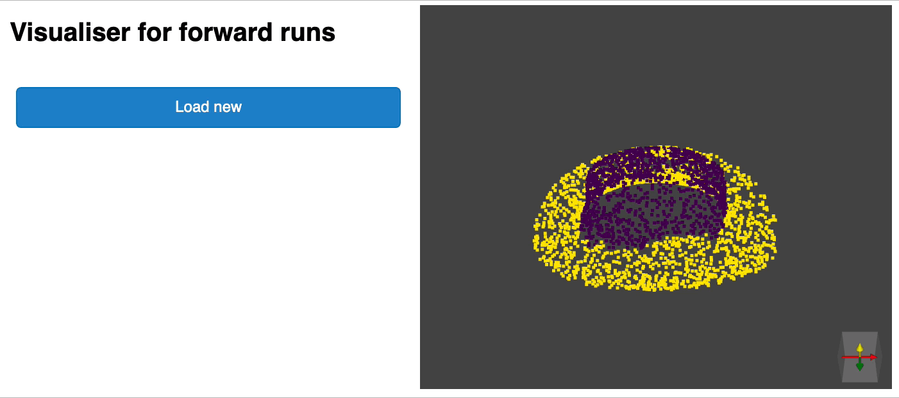

[](https://codecov.io/gh/nicolas-chaulet/deeppointcloud-benchmarks) [](https://github.com/nicolas-chaulet/deeppointcloud-benchmarks/actions)


This is a framework for running common deep learning models for point cloud analysis tasks against classic benchmark. It heavily relies on pytorch geometric and hydra core.

**[Documentation](https://deeppointcloud-benchmarks.readthedocs.io/en/latest/)** | **[Pytorch Geometric](https://pytorch-geometric.readthedocs.io/en/latest/notes/resources.html)** | **[Facebook Hydra](https://hydra.cc/)**

The framework allows lean and yet complex model to be built with minimum effort and great reproducibility.

## Getting started
### Requirements:
* CUDA > 10
* Python 3 + headers (python-dev)
* [Poetry](https://poetry.eustace.io/) (Optional but highly recommended)

### Setup repo
Clone the repo to your local machine then run the following command from the root of the repo
```
poetry install
```
This will install all required dependencies in a new virtual environment.

Activate it

```bash
poetry shell

```bash
You can check that the install has been successful by running

```nash
python -m unittest
```

## Train pointnet++ on part segmentation task for dataset shapenet

```bash
poetry run python train.py task=segmentation model_type=pointnet2 model_name=pointnet2_charlesssg dataset=shapenet
```
And you should see something like that


The [config](conf/models/segmentation/pointnet2.yaml) for pointnet++ is a good example of how to define a model and is as follow:

```yaml
# PointNet++: Deep Hierarchical Feature Learning on Point Sets in a Metric Space (https://arxiv.org/abs/1706.02413)
# Credit Charles R. Qi: https://github.com/charlesq34/pointnet2/blob/master/models/pointnet2_part_seg_msg_one_hot.py

pointnet2_onehot:
    architecture: pointnet2.PointNet2_D
    conv_type: "DENSE"
    use_category: True
    down_conv:
        module_name: PointNetMSGDown
        npoint: [1024, 256, 64, 16]
        radii: [[0.05, 0.1], [0.1, 0.2], [0.2, 0.4], [0.4, 0.8]]
        nsamples: [[16, 32], [16, 32], [16, 32], [16, 32]]
        down_conv_nn:
            [
                [[FEAT, 16, 16, 32], [FEAT, 32, 32, 64]],
                [[32 + 64, 64, 64, 128], [32 + 64, 64, 96, 128]],
                [[128 + 128, 128, 196, 256], [128 + 128, 128, 196, 256]],
                [[256 + 256, 256, 256, 512], [256 + 256, 256, 384, 512]],
            ]
    up_conv:
        module_name: DenseFPModule
        up_conv_nn:
            [
                [512 + 512 + 256 + 256, 512, 512],
                [512 + 128 + 128, 512, 512],
                [512 + 64 + 32, 256, 256],
                [256 + FEAT, 128, 128],
            ]
        skip: True
    mlp_cls:
        nn: [128, 128]
        dropout: 0.5
```

# Benchmark
## S3DIS 1x1


| Model Name | # params | Speed Train / Test | Cross Entropy | OAcc | mIou | mAcc |
| ------------- | ------------- | ------------- | ------------- | ------------- | ------------- | ------------- |
| [```pointnet2_original```](/benchmark/s3dis_fold5/Pointnet2_original.md)|3,026,829|04:29 / 01:07(RTX 2060)|0.0512|85.26|45.58|73.11 |


## Shapenet part segmentation
The data reported below correspond to the part segmentation problem for Shapenet for all categories. We report against mean instance IoU and mean class IoU (average of the mean instance IoU per class)

| Model Name | Use Normals | # params | Speed Train / Test | Cross Entropy | CmIou | ImIou |
| ------------- | ------------- | ------------- | ------------- | ------------- | ------------- | ------------- |
| [```pointnet2_charlesmsg```](/benchmark/shapenet/pointnet2_charlesmsg.md) | Yes | 1,733,946 | 15:07 / 01:20 (K80) | 0.089 | 82.1 | 85.1 |
| [```RSCNN_MSG```](/benchmark/shapenet/rscnn_original.md) | No | 3,488,417 | 05:40 / 0:24 (RTX 2060) | 0.04 | 82.811 | 85.3 |

## Explore your experiments
We provide a [notebook](dashboard/dashboard.ipynb) based [pyvista](https://docs.pyvista.org/) and [panel](https://panel.holoviz.org/) that allows you to explore your past experiments visually. When using jupyter lab you will have to install an extension:
```
jupyter labextension install @pyviz/jupyterlab_pyviz
```
Run through the notebook and you should see a dashboard starting that looks like the following:


## Inference
### Inference script
We provide a script for running a given pre trained model on custom data that may not be annotated. You will find an [example](forward_scripts/forward.py) of this for the part segmentation task on Shapenet. Just like for the rest of the codebase most of the customization happens through config files and the provided example can be extended to other datasets. You can also easily create your own from there. Going back to the part segmentation task, say you have a folder full of point clouds that you know are Airplanes, and you have the checkpoint of a model trained on Airplanes and potentially other classes, simply edit the [config.yaml](forward_scripts/conf/config.yaml) and [shapenet.yaml](forward_scripts/conf/dataset/shapenet.yaml) and run the following command:

```bash
python forward_scripts/forward.py
```

The result of the forward run will be placed in the specified `output_folder` and you can use the [notebook](forward_scripts/notebooks/viz_shapenet.ipynb) provided to explore the results. Below is an example of the outcome of using a model trained on caps only to find the parts of airplanes and caps.



### Containerize your model with Docker

Finally, for people interested in deploying their models to production environments, we provide a [Dockerfile](docker/Dockerfile) as well as a [build script](docker/build.sh). Say you have trained a network for semantic segmentation that gave the weight `<outputfolder/weights.pt>`, the following command will build a docker image for you:

```bash
cd docker
./build.sh outputfolder/weights.pt
```

You can then use it to run a forward pass on a all the point clouds in `input_path` and generate the results in `output_path`

```bash
docker run -v /test_data:/in -v /test_data/out:/out pointnet2_charlesssg:latest python3 forward_scripts/forward.py dataset=shapenet data.forward_category=Cap input_path="/in" output_path="/out"
```

The `-v` option mounts a local directory to the container's file system. For example in the command line above, `/test_data/out` will be mounted at the location `/out`. As a consequence, all files written in `/out` will be available in the folder `/test_data/out` on your machine.

## Troubleshooting
#### Undefined symbol / Updating Pytorch
When we update the version of Pytorch that is used, the compiled packages need to be reinstalled, otherwise you will run into an error that looks like this:
```
... scatter_cpu.cpython-36m-x86_64-linux-gnu.so: undefined symbol: _ZN3c1012CUDATensorIdEv
```
This can happen for the following libraries:

* torch-points
* torch-scatter
* torch-cluster
* torch-sparse

An easy way to fix this is to run the following command with the virtual env activated:
```
pip uninstall torch-scatter torch-sparse torch-cluster torch-points -y
rm -rf ~/.cache/pip
poetry install
```

## Contributing
Contributions are welcome! The only asks are that you stick to the styling and that you add tests as you add more features!
For styling you can use [pre-commit hooks](https://ljvmiranda921.github.io/notebook/2018/06/21/precommits-using-black-and-flake8/) to help you:
```
pre-commit install
```
A sequence of checks will be run for you and you may have to add the fixed files again to the stashed files.

## Contributors
- [Thomas Chaton](https://github.com/tchaton)
- [Nicolas Chaulet](https://github.com/nicolas-chaulet)
- [Tristan Heywood](https://github.com/tristanheywood)
