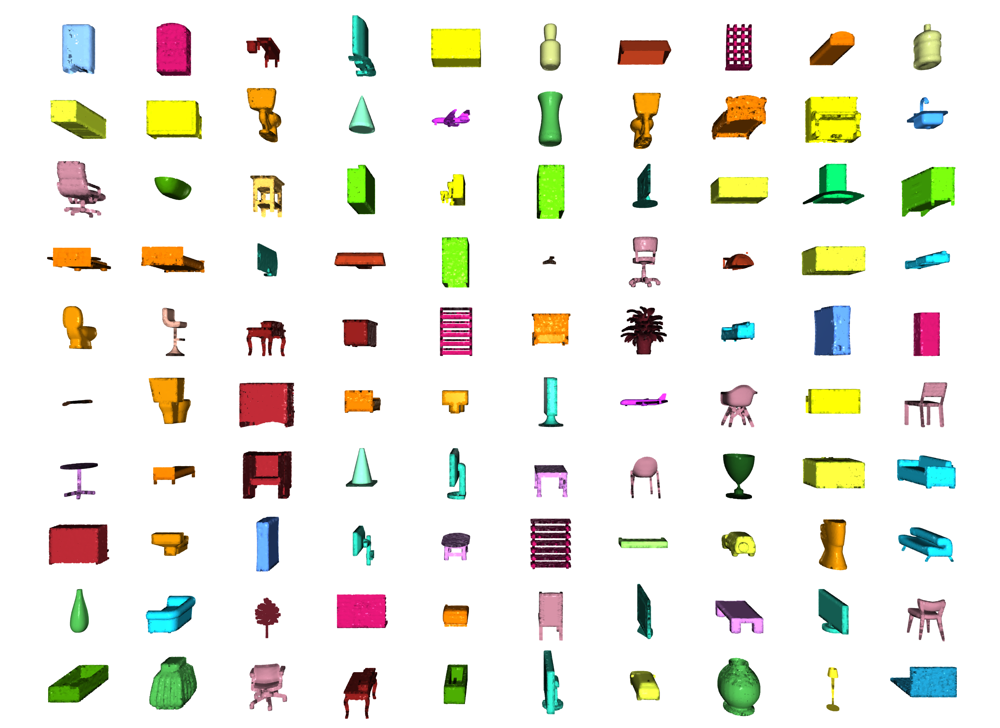

<p align="center">
  
</p>

[](https://badge.fury.io/py/torch-points3d) [](https://codecov.io/gh/nicolas-chaulet/torch-points3d) [](https://github.com/nicolas-chaulet/torch-points3d/actions) [](https://torch-points3d.readthedocs.io/en/latest/?badge=latest) [](https://join.slack.com/t/torchgeometricco/shared_invite/zt-p6br3yuo-BxRoe36OHHLF6jYU8xHtBA)

This is a framework for running common deep learning models for point cloud analysis tasks against classic benchmark. It heavily relies on [Pytorch Geometric](https://pytorch-geometric.readthedocs.io/en/latest/notes/resources.html) and [Facebook Hydra](https://hydra.cc/).

The framework allows lean and yet complex model to be built with minimum effort and great reproducibility.
It also provide a high level API to democratize deep learning on pointclouds.
See our [paper](https://arxiv.org/pdf/2010.04642.pdf) at 3DV for an overview of the framework capacities and benchmarks of state-of-the-art networks.

# Overview

## Requirements

- CUDA 10 or higher (if you want GPU version)
- Python 3.7 or higher + headers (python-dev)
- PyTorch 1.7 or higher
- A Sparse convolution backend (optional) see [here](https://github.com/nicolas-chaulet/torch-points3d#3d-sparse-convolution-support) for installation instructions

Install with

```bash
pip install torch
pip install torch-points3d
```

## Project structure

```bash
├─ benchmark               # Output from various benchmark runs
├─ conf                    # All configurations for training nad evaluation leave there
├─ notebooks               # A collection of notebooks that allow result exploration and network debugging
├─ docker                  # Docker image that can be used for inference or training
├─ docs                    # All the doc
├─ eval.py                 # Eval script
├─ find_neighbour_dist.py  # Script to find optimal #neighbours within neighbour search operations
├─ forward_scripts         # Script that runs a forward pass on possibly non annotated data
├─ outputs                 # All outputs from your runs sorted by date
├─ scripts                 # Some scripts to help manage the project
├─ torch_points3d
    ├─ core                # Core components
    ├─ datasets            # All code related to datasets
    ├─ metrics             # All metrics and trackers
    ├─ models              # All models
    ├─ modules             # Basic modules that can be used in a modular way
    ├─ utils               # Various utils
    └─ visualization       # Visualization
├─ test
└─ train.py                # Main script to launch a training
```

As a general philosophy we have split datasets and models by task. For example, datasets has five subfolders:

- segmentation
- classification
- registration
- object_detection
- panoptic

where each folder contains the dataset related to each task.

## Methods currently implemented

- **[PointNet](https://github.com/nicolas-chaulet/torch-points3d/blob/master/torch_points3d/modules/PointNet/modules.py#L54)** from Charles R. Qi _et al._: [PointNet: Deep Learning on Point Sets for 3D Classification and Segmentation](https://arxiv.org/abs/1612.00593) (CVPR 2017)
- **[PointNet++](https://github.com/nicolas-chaulet/torch-points3d/tree/master/torch_points3d/modules/pointnet2)** from Charles from Charles R. Qi _et al._: [PointNet++: Deep Hierarchical Feature Learning on Point Sets in a Metric Space](https://arxiv.org/abs/1706.02413)
- **[RSConv](https://github.com/nicolas-chaulet/torch-points3d/tree/master/torch_points3d/modules/RSConv)** from Yongcheng Liu _et al._: [Relation-Shape Convolutional Neural Network for Point Cloud Analysis](https://arxiv.org/abs/1904.07601) (CVPR 2019)
- **[RandLA-Net](https://github.com/nicolas-chaulet/torch-points3d/tree/master/torch_points3d/modules/RandLANet)** from Qingyong Hu _et al._: [RandLA-Net: Efficient Semantic Segmentation of Large-Scale Point Clouds](https://arxiv.org/abs/1911.11236)
- **[PointCNN](https://github.com/nicolas-chaulet/torch-points3d/tree/master/torch_points3d/modules/PointCNN)** from Yangyan Li _et al._: [PointCNN: Convolution On X-Transformed Points](https://arxiv.org/abs/1801.07791) (NIPS 2018)
- **[KPConv](https://github.com/nicolas-chaulet/torch-points3d/tree/master/torch_points3d/modules/KPConv)** from Hugues Thomas _et al._: [KPConv: Flexible and Deformable Convolution for Point Clouds](https://arxiv.org/abs/1904.08889) (ICCV 2019)
- **[MinkowskiEngine](https://github.com/nicolas-chaulet/torch-points3d/tree/master/torch_points3d/modules/MinkowskiEngine)** from Christopher Choy _et al._: [4D Spatio-Temporal ConvNets: Minkowski Convolutional Neural Networks](https://arxiv.org/abs/1904.08755) (CVPR19)
- **[VoteNet](https://github.com/nicolas-chaulet/torch-points3d/tree/master/torch_points3d/models/object_detection/votenet.py)** from Charles R. Qi _et al._: [Deep Hough Voting for 3D Object Detection in Point Clouds](https://arxiv.org/abs/1904.09664) (ICCV 19)
- **[FCGF](https://github.com/chrischoy/FCGF)** from Christopher Choy _et al._: [Fully Convolutional Geometric Features](https://node1.chrischoy.org/data/publications/fcgf/fcgf.pdf) (ICCV'19)
- **[PointGroup](https://github.com/Jia-Research-Lab/PointGroup)** from Li Jiang _et al._: [PointGroup: Dual-Set Point Grouping for 3D Instance Segmentation](https://arxiv.org/abs/2004.01658)
- **[PPNet (PosPool)](https://github.com/zeliu98/CloserLook3D)** from Ze Liu _et al._: [A Closer Look at Local Aggregation Operators in Point Cloud Analysis](https://arxiv.org/pdf/2007.01294.pdf) (ECCV 2020)
- **[TorchSparse](https://github.com/mit-han-lab/torchsparse)** from Haotian Tang _et al_: [Searching Efficient 3D Architectures with Sparse Point-Voxel Convolution](https://arxiv.org/abs/2007.16100)
- **[PVCNN](https://github.com/mit-han-lab/pvcnn)** model for semantic segmentation from Zhijian Liu _et al_:[Point-Voxel CNN for Efficient 3D Deep Learning](https://arxiv.org/abs/1907.03739)
- **[MS-SVConv](https://github.com/humanpose1/MS-SVConv)** from Sofiane Horache _et al_: [3D Point Cloud Registration with Multi-Scale Architecture and Self-supervised Fine-tuning](https://arxiv.org/abs/2103.14533)

Please refer to our [documentation](https://torch-points3d.readthedocs.io/en/latest/src/api/models.html) for accessing some of those models directly from the API and see our example notebooks for [KPconv](https://colab.research.google.com/github/nicolas-chaulet/torch-points3d/blob/master/notebooks/PartSegmentationKPConv.ipynb) and [RSConv](https://colab.research.google.com/github/nicolas-chaulet/torch-points3d/blob/master/notebooks/ObjectClassificationRSConv.ipynb) for more details.

# Available Tasks

|               <h3> Tasks </h3>                |                      <h3> Examples </h3>                      |
| :-------------------------------------------: | :-----------------------------------------------------------: |
| <h3> Classification / Part Segmentation </h3> |  <br /> |
|            <h3> Segmentation </h3>            |     <br />    |
|          <h3> Object Detection </h3>          |                |
|       <h3> Panoptic Segmentation </h3>        |               |
|            <h3> Registration </h3>            |            |

# Available datasets

## Segmentation

- **[Scannet](https://github.com/ScanNet/ScanNet)** from Angela Dai _et al._: [ScanNet: Richly-annotated 3D Reconstructions of Indoor Scenes](https://arxiv.org/abs/1702.04405)

- **[S3DIS](http://buildingparser.stanford.edu/dataset.html)** from Iro Armeni _et al._: [Joint 2D-3D-Semantic Data for Indoor Scene Understanding](https://arxiv.org/abs/1702.01105)

```
* S3DIS 1x1
* S3DIS Room
* S3DIS Fused - Sphere | Cylinder
```

- **[Shapenet](https://www.shapenet.org/)** from Angel X. Chang _et al._: [ShapeNet: An Information-Rich 3D Model Repository](https://arxiv.org/abs/1512.03012)

## Object detection and panoptic

- **[Scannet](https://github.com/ScanNet/ScanNet)** from Angela Dai _et al._: [ScanNet: Richly-annotated 3D Reconstructions of Indoor Scenes](https://arxiv.org/abs/1702.04405)
- **[S3DIS](http://buildingparser.stanford.edu/dataset.html)** from Iro Armeni _et al._: [Joint 2D-3D-Semantic Data for Indoor Scene Understanding](https://arxiv.org/abs/1702.01105)

```
* S3DIS Fused - Sphere | Cylinder
```

- **[SemanticKitti](http://semantic-kitti.org/)** from J. Behley _et al_: [SemanticKITTI: A Dataset for Semantic Scene Understanding of LiDAR Sequences](https://arxiv.org/abs/1904.01416)

## Registration

- **[3DMatch](http://3dmatch.cs.princeton.edu)** from Andy Zeng _et al._: [3DMatch: Learning Local Geometric Descriptors from RGB-D Reconstructions](https://arxiv.org/abs/1603.08182)

- **[The IRALab Benchmark](https://github.com/iralabdisco/point_clouds_registration_benchmark)** from Simone Fontana _et al._:[A Benchmark for Point Clouds Registration Algorithms](https://arxiv.org/abs/2003.12841), which is composed of data from:

  - [the ETH datasets](https://projects.asl.ethz.ch/datasets/doku.php?id=laserregistration:laserregistration);
  - [the Canadian Planetary Emulation Terrain 3D Mapping datasets](http://asrl.utias.utoronto.ca/datasets/3dmap/index.html);
  - [the TUM Vision Groud RGBD datasets](https://vision.in.tum.de/data/datasets/rgbd-dataset);
  - [the KAIST Urban datasets](https://irap.kaist.ac.kr/dataset/).

- **[Kitti odometry](http://www.cvlibs.net/datasets/kitti/eval_odometry.php)** with corrected poses (thanks to @humanpose1) from A. Geiger _et al_: [Are we ready for Autonomous Driving? The KITTI Vision Benchmark Suite](http://www.cvlibs.net/publications/Geiger2012CVPR.pdf)

## Classification

- **[ModelNet](https://modelnet.cs.princeton.edu)** from Zhirong Wu _et al._: [3D ShapeNets: A Deep Representation for Volumetric Shapes](https://people.csail.mit.edu/khosla/papers/cvpr2015_wu.pdf)

# 3D Sparse convolution support

We currently support [Minkowski Engine](https://github.com/StanfordVL/MinkowskiEngine) > v0.5 and [torchsparse](https://github.com/mit-han-lab/torchsparse) as backends for sparse convolutions. Those packages need to be installed independently from Torch Points3d, please follow installation instructions and troubleshooting notes on the respective repositories. At the moment `MinkowskiEngine` [see here (thank you Chris Choy)](https://gist.github.com/chrischoy/d8e971daf8308aa1dcba1524bf1fd91a) demonstrates faster training. **Please be aware that `torchsparse` is still in beta and does not support CPU only training.**

Once you have setup one of those two sparse convolution framework you can start using are high level to define a unet backbone or simply an encoder:

```python
from torch_points3d.applications.sparseconv3d import SparseConv3d

model = SparseConv3d("unet", input_nc=3, output_nc=5, num_layers=4, backend="torchsparse") # minkowski by default
```

You can also assemble your own networks by using the modules provided in `torch_points3d/modules/SparseConv3d/nn`. For example if you wish to use `torchsparse` backend you can do the following:

```python
import torch_points3d.modules.SparseConv3d as sp3d

sp3d.nn.set_backend("torchsparse")
conv = sp3d.nn.Conv3d(10, 10)
bn = sp3d.nn.BatchNorm(10)
```

### Mixed Precision Training

Mixed precision allows for lower memory on the GPU and slightly faster training times by performing the sparse convolution, pooling, and gradient ops in `float16`. Mixed precision training is currently supported for CUDA training on `SparseConv3d` networks with the [torchsparse](https://github.com/mit-han-lab/torchsparse) backend. To enable mixed precision, ensure you have the latest version of torchsparse with `pip install --upgrade git+https://github.com/mit-han-lab/torchsparse.git`. Then, set `training.enable_mixed=True` in your training configuration files. If all the conditions are met, when you start training you will see a log entry stating: 

`[torch_points3d.models.base_model][INFO] - Model will use mixed precision`

If, however, you try to use mixed precision training with an unsupported backend, you will see:

`[torch_points3d.models.base_model][WARNING] - Mixed precision is not supported on this model, using default precision...`

# Adding your model to the PretrainedRegistry.

The `PretrainedRegistry` enables anyone to add their own pre-trained models and `re-create` them with only 2 lines of code for `finetunning` or `production` purposes.

- `[You]` Launch your model training with [Wandb](https://www.wandb.com) activated (`wandb.log=True`)
- `[TorchPoints3d]` Once the training finished, `TorchPoints3d` will upload your trained model within [our custom checkpoint](https://app.wandb.ai/nicolas/scannet/runs/1sd84bf1) to your wandb.
- `[You]` Within [`PretainedRegistry`](https://github.com/nicolas-chaulet/torch-points3d/blob/master/torch_points3d/applications/pretrained_api.py#L31) class, add a `key-value pair` within its attribute `MODELS`. The `key` should be describe your model, dataset and training hyper-parameters (possibly the best model), the `value` should be the `url` referencing the `.pt` file on your wandb.

Example: Key: `pointnet2_largemsg-s3dis-1` and URL value: `https://api.wandb.ai/files/loicland/benchmark-torch-points-3d-s3dis/1e1p0csk/pointnet2_largemsg.pt` for the `pointnet2_largemsg.pt` file.
The key desribes a `pointnet2 largemsg trained on s3dis fold 1`.

- `[Anyone]` By using the `PretainedRegistry` class and by providing the `key`, the associated model weights will be `downloaded` and the pre-trained model will be `ready to use` with its transforms.

```python
[In]:
from torch_points3d.applications.pretrained_api import PretainedRegistry

model = PretainedRegistry.from_pretrained("pointnet2_largemsg-s3dis-1")

print(model.wandb)
print(model.print_transforms())

[Out]:
=================================================== WANDB URLS ======================================================
WEIGHT_URL: https://api.wandb.ai/files/loicland/benchmark-torch-points-3d-s3dis/1e1p0csk/pointnet2_largemsg.pt
LOG_URL: https://app.wandb.ai/loicland/benchmark-torch-points-3d-s3dis/runs/1e1p0csk/logs
CHART_URL: https://app.wandb.ai/loicland/benchmark-torch-points-3d-s3dis/runs/1e1p0csk
OVERVIEW_URL: https://app.wandb.ai/loicland/benchmark-torch-points-3d-s3dis/runs/1e1p0csk/overview
HYDRA_CONFIG_URL: https://app.wandb.ai/loicland/benchmark-torch-points-3d-s3dis/runs/1e1p0csk/files/hydra-config.yaml
OVERRIDES_URL: https://app.wandb.ai/loicland/benchmark-torch-points-3d-s3dis/runs/1e1p0csk/files/overrides.yaml
======================================================================================================================

pre_transform = None
test_transform = Compose([
    FixedPoints(20000, replace=True),
    XYZFeature(axis=['z']),
    AddFeatsByKeys(rgb=True, pos_z=True),
    Center(),
    ScalePos(scale=0.5),
])
train_transform = Compose([
    FixedPoints(20000, replace=True),
    RandomNoise(sigma=0.001, clip=0.05),
    RandomRotate((-180, 180), axis=2),
    RandomScaleAnisotropic([0.8, 1.2]),
    RandomAxesSymmetry(x=True, y=False, z=False),
    DropFeature(proba=0.2, feature='rgb'),
    XYZFeature(axis=['z']),
    AddFeatsByKeys(rgb=True, pos_z=True),
    Center(),
    ScalePos(scale=0.5),
])
val_transform = Compose([
    FixedPoints(20000, replace=True),
    XYZFeature(axis=['z']),
    AddFeatsByKeys(rgb=True, pos_z=True),
    Center(),
    ScalePos(scale=0.5),
])
inference_transform = Compose([
    FixedPoints(20000, replace=True),
    XYZFeature(axis=['z']),
    AddFeatsByKeys(rgb=True, pos_z=True),
    Center(),
    ScalePos(scale=0.5),
])
pre_collate_transform = Compose([
    PointCloudFusion(),
    SaveOriginalPosId,
    GridSampling3D(grid_size=0.04, quantize_coords=False, mode=mean),
])
```

# Developer guidelines

## Setting repo

We use [Poetry](https://poetry.eustace.io/) for managing our packages.
In order to get started, clone this repositories and run the following command from the root of the repo

```
poetry install --no-root
```

This will install all required dependencies in a new virtual environment.

Activate the environment

```bash
poetry shell
```

You can check that the install has been successful by running

```bash
python -m unittest -v
```

For `pycuda` support (only needed for the registration tasks):

```bash
pip install pycuda
```

## Getting started: Train pointnet++ on part segmentation task for dataset shapenet

```bash
poetry run python train.py task=segmentation models=segmentation/pointnet2 model_name=pointnet2_charlesssg data=segmentation/shapenet-fixed
```

And you should see something like that


The [config](https://raw.githubusercontent.com/nicolas-chaulet/torch-points3d/master/conf/models/segmentation/pointnet2.yaml) for pointnet++ is a good example of how to define a model and is as follow:

```yaml
# PointNet++: Deep Hierarchical Feature Learning on Point Sets in a Metric Space (https://arxiv.org/abs/1706.02413)
# Credit Charles R. Qi: https://github.com/charlesq34/pointnet2/blob/master/models/pointnet2_part_seg_msg_one_hot.py

pointnet2_onehot:
  architecture: pointnet2.PointNet2_D
  conv_type: "DENSE"
  use_category: True
  down_conv:
    module_name: PointNetMSGDown
    npoint: [1024, 256, 64, 16]
    radii: [[0.05, 0.1], [0.1, 0.2], [0.2, 0.4], [0.4, 0.8]]
    nsamples: [[16, 32], [16, 32], [16, 32], [16, 32]]
    down_conv_nn:
      [
        [[FEAT, 16, 16, 32], [FEAT, 32, 32, 64]],
        [[32 + 64, 64, 64, 128], [32 + 64, 64, 96, 128]],
        [[128 + 128, 128, 196, 256], [128 + 128, 128, 196, 256]],
        [[256 + 256, 256, 256, 512], [256 + 256, 256, 384, 512]],
      ]
  up_conv:
    module_name: DenseFPModule
    up_conv_nn:
      [
        [512 + 512 + 256 + 256, 512, 512],
        [512 + 128 + 128, 512, 512],
        [512 + 64 + 32, 256, 256],
        [256 + FEAT, 128, 128],
      ]
    skip: True
  mlp_cls:
    nn: [128, 128]
    dropout: 0.5
```

## Inference

### Inference script

We provide a script for running a given pre trained model on custom data that may not be annotated. You will find an [example](https://github.com/nicolas-chaulet/torch-points3d/blob/master/forward_scripts/forward.py) of this for the part segmentation task on Shapenet. Just like for the rest of the codebase most of the customization happens through config files and the provided example can be extended to other datasets. You can also easily create your own from there. Going back to the part segmentation task, say you have a folder full of point clouds that you know are Airplanes, and you have the checkpoint of a model trained on Airplanes and potentially other classes, simply edit the [config.yaml](https://github.com/nicolas-chaulet/torch-points3d/blob/master/forward_scripts/conf/config.yaml) and [shapenet.yaml](https://github.com/nicolas-chaulet/torch-points3d/blob/master/forward_scripts/conf/dataset/shapenet.yaml) and run the following command:

```bash
python forward_scripts/forward.py
```

The result of the forward run will be placed in the specified `output_folder` and you can use the [notebook](https://github.com/nicolas-chaulet/torch-points3d/blob/master/forward_scripts/notebooks/viz_shapenet.ipynb) provided to explore the results. Below is an example of the outcome of using a model trained on caps only to find the parts of airplanes and caps.


### Containerizing your model with Docker

Finally, for people interested in deploying their models to production environments, we provide a [Dockerfile](https://github.com/nicolas-chaulet/torch-points3d/blob/master/docker/Dockerfile) as well as a [build script](https://github.com/nicolas-chaulet/torch-points3d/blob/master/docker/build.sh). Say you have trained a network for semantic segmentation that gave the weight `<outputfolder/weights.pt>`, the following command will build a docker image for you:

```bash
cd docker
./build.sh outputfolder/weights.pt
```

You can then use it to run a forward pass on a all the point clouds in `input_path` and generate the results in `output_path`

```bash
docker run -v /test_data:/in -v /test_data/out:/out pointnet2_charlesssg:latest python3 forward_scripts/forward.py dataset=shapenet data.forward_category=Cap input_path="/in" output_path="/out"
```

The `-v` option mounts a local directory to the container's file system. For example in the command line above, `/test_data/out` will be mounted at the location `/out`. As a consequence, all files written in `/out` will be available in the folder `/test_data/out` on your machine.

## Profiling

We advice to use [`snakeviz`](https://jiffyclub.github.io/snakeviz/) and [`cProfile`](https://docs.python.org/2/library/profile.html)

Use cProfile to profile your code

```
poetry run python -m cProfile -o {your_name}.prof train.py ... debugging.profiling=True
```

And visualize results using snakeviz.

```
snakeviz {your_name}.prof
```

It is also possible to use [`torch.utils.bottleneck`](https://pytorch.org/docs/stable/bottleneck.html)

```
python -m torch.utils.bottleneck /path/to/source/script.py [args]
```

## Troubleshooting

### Cannot compile certain CUDA Kernels or seg faults while running the tests

Ensure that at least PyTorch 1.4.0 is installed and verify that `cuda/bin` and `cuda/include` are in your `$PATH` and `$CPATH` respectively, e.g.:

```
$ python -c "import torch; print(torch.__version__)"
>>> 1.4.0

$ echo $PATH
>>> /usr/local/cuda/bin:...

$ echo $CPATH
>>> /usr/local/cuda/include:...
```

### Undefined symbol / Updating Pytorch

When we update the version of Pytorch that is used, the compiled packages need to be reinstalled, otherwise you will run into an error that looks like this:

```
... scatter_cpu.cpython-36m-x86_64-linux-gnu.so: undefined symbol: _ZN3c1012CUDATensorIdEv
```

This can happen for the following libraries:

- torch-points-kernels
- torch-scatter
- torch-cluster
- torch-sparse

An easy way to fix this is to run the following command with the virtual env activated:

```
pip uninstall torch-scatter torch-sparse torch-cluster torch-points-kernels -y
rm -rf ~/.cache/pip
poetry install
```

### CUDA kernel failed : no kernel image is available for execution on the device

This can happen when trying to run the code on a different GPU than the one used to compile the `torch-points-kernels` library. Uninstall `torch-points-kernels`, clear cache, and reinstall after setting the `TORCH_CUDA_ARCH_LIST` environment variable. For example, for compiling with a Tesla T4 (Turing 7.5) and running the code on a Tesla V100 (Volta 7.0) use:

```
export TORCH_CUDA_ARCH_LIST="7.0;7.5"
```

See [this useful chart](http://arnon.dk/matching-sm-architectures-arch-and-gencode-for-various-nvidia-cards/) for more architecture compatibility.

### Cannot use wandb on Windows

Raises `OSError: [WinError 6] The handle is invalid` / `wandb: ERROR W&B process failed to launch`
Wandb is currently broken on Windows (see [this issue](https://github.com/wandb/client/issues/862)), a workaround is to use the command line argument `wandb.log=false`

# Exploring your experiments

We provide a [notebook](https://github.com/nicolas-chaulet/torch-points3d/blob/master/notebooks/dashboard.ipynb) based [pyvista](https://docs.pyvista.org/) and [panel](https://panel.holoviz.org/) that allows you to explore your past experiments visually. When using jupyter lab you will have to install an extension:

```
jupyter labextension install @pyviz/jupyterlab_pyviz
```

Run through the notebook and you should see a dashboard starting that looks like the following:


# Contributing

Contributions are welcome! The only asks are that you stick to the styling and that you add tests as you add more features!

For styling you can use [pre-commit hooks](https://ljvmiranda921.github.io/notebook/2018/06/21/precommits-using-black-and-flake8/) to help you:

```
pre-commit install
```

A sequence of checks will be run for you and you may have to add the fixed files again to the stashed files.

When it comes to docstrings we use [numpy style](https://numpydoc.readthedocs.io/en/latest/format.html) docstrings, for those who use
Visual Studio Code, there is a great [extension](https://github.com/NilsJPWerner/autoDocstring) that can help with that. Install it and set the format to numpy and you should be good to go!

Finaly, if you want to have a direct chat with us feel free to join our slack, just shoot us an email and we'll add you.

# Citing

If you find our work useful, do not hesitate to cite it:

```
@inproceedings{
  tp3d,
  title={Torch-Points3D: A Modular Multi-Task Frameworkfor Reproducible Deep Learning on 3D Point Clouds},
  author={Chaton, Thomas and Chaulet Nicolas and Horache, Sofiane and Landrieu, Loic},
  booktitle={2020 International Conference on 3D Vision (3DV)},
  year={2020},
  organization={IEEE},
  url = {\url{https://github.com/nicolas-chaulet/torch-points3d}}
}
```

and please also include a citation to the
[models](https://github.com/nicolas-chaulet/torch-points3d#methods-currently-implemented)
or the [datasets](https://github.com/nicolas-chaulet/torch-points3d#available-datasets) you have used in your experiments!
