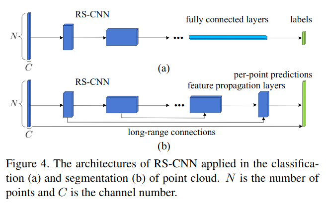
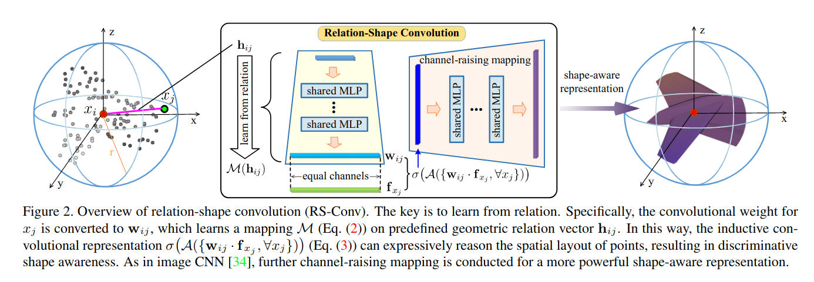

# Understand hydra configuration

We recommend people willing to use the framework to get familiries with [```Facebook Hydra library```](https://hydra.cc/docs/intro).

Reading quickly through Hydra documentation should give one the basic understanding of its core functionalites.

To make it short, it is [```argparse```](https://docs.python.org/2/library/argparse.html) built on top of yaml file, allowing ```arguments to be defined in a tree structure```.


<h2>Configuration architecture</h2>

* config.yaml
    * models/
        * segmentation.yaml (architecture of all seg models)


<h4>Experiment</h4>

The experiment conf defines are going to be done.


```yaml
experiment:
    experiment_name: "" # Wether to use hydra naming convention for the experiment
    log_dir: "" # Wether to use hydra automatic path generation for saving training
    resume: True  # Wether to load model
    name: RSConv_2LD # Name of the model to be created
    task: segmentation # Task to be benchmarked
    dataset: shapenet # Dataset to be loaded
```

<h6> The associated logging </h6>

As experiment is empty, it will use hydra naming convention for the experiment
As log_dir is empty, it will use hydra naming convention for the log directory
{path_to_project}/outputs/2019-12-28/12-05-45 (Y-M-D/H-M-S)

The ```name``` is let to the user choose.

<h6>The associated dataset</h6>

```experiment.dataset``` value is used as a key to dynamically choose the associated dataset arguments


<h6> The associated visualization </h6>

The framework currently support both [```wandb```](https://www.wandb.com/) and [```tensorboard```](https://www.tensorflow.org/tensorboard)

```yaml
# parameters for Weights and Biases
wandb:
    project: benchmarking
    log: False

# parameters for TensorBoard Visualization
tensorboard:
    log: True
```

<h4> Training arguments </h4>

```yaml
training:
    shuffle: True
    num_workers: 8
    batch_size: 8
    cuda: 1
    epochs: 350
    optimizer: Adam
    lr : 0.001
    weight_name: 'default'
    precompute_multi_scale: False
```

</br>

* ```weight_name```: Used when ```resume is True```, ```select``` with model to load from ```[metric_name..., default]```

* ```precompute_multi_scale```: Compute multiscate features on cpu for faster

<h4> Architecture of the loaded model </h4>

```experiment.name``` value is used as a key to dynamically choose the associated model architecture

Here, ```RSConv_2LD``` is a child model from the ```type: RSConv```.

```python
RSConv_2LD:
    type: RSConv
    down_conv:
        module_name: RSConv
        ratios: [0.2, 0.25]
        radius: [0.1, 0.2]
        local_nn: [[10, 8, FEAT], [10, 32, 64, 64]]
        down_conv_nn: [[FEAT, 16, 32, 64], [64, 64, 128]]
    innermost:
        module_name: GlobalBaseModule
        aggr: max
        nn: [128 + FEAT, 128] 
    up_conv:
        module_name: FPModule
        ratios: [1, 0.25, 0.2]
        radius: [0.2, 0.2, 0.1]
        up_conv_nn: [[128 + 128, 64], [64 + 64, 64], [64, 64]]
        up_k: [1, 3, 3]
        skip: True
    mlp_cls:
        nn: [64, 64, 64, 64]
        dropout: 0.5
```

Model definition will be discussed more in details later on.


# Create a new dataset

Create ShapeNet dataset from ```Pytorch Geometric```

Naming matters as we use them to automatically create the dataset with its given arguments.

One need to create a new file in datasets/ with the following name {dataset_name}_dataset.py.
We create ```shapenet_dataset.py``` file.

One need to create a dataset class with the following name {dataset_name}dataset.py ().
We create ```ShapeNetDataset.py``` class which inherit from ```BaseDataset``` class.
The dataset is going to receive automatically the associated dataset_opt, training_opt.

```python
class ShapeNetDataset(BaseDataset):
    
    def __init__(self, dataset_opt, training_opt):
        super().__init__(dataset_opt, training_opt)

        ...
        
```

In order to implement a working dataset, one should define a train_dataset, test_dataset and (optionally: val_dataset)
and call the ```create_dataloaders``` function with the created {}_dataset from the parent ```BaseDataset``` class


```python
class ShapeNetDataset(BaseDataset):
    
    def __init__(self, dataset_opt, training_opt):
        super().__init__(dataset_opt, training_opt)
        
        self._data_path = os.path.join(dataset_opt.dataroot, 'ShapeNet')
        self._category = dataset_opt.category
        pre_transform = T.NormalizeScale()
        train_dataset = ShapeNet(self._data_path, self._category, train=True,
                                 pre_transform=pre_transform)
        test_dataset = ShapeNet(self._data_path, self._category, train=False,
                                pre_transform=pre_transform)

        # The function creates the associated dataset using the training arguments and some dataset_opt
        self._create_dataloaders(train_dataset, test_dataset, val_dataset=None)
```

Here is the implementation of BaseDataset

```python
class BaseDataset():
    def __init__(self, dataset_opt, training_opt):
        self.dataset_opt = dataset_opt
        self.training_opt = training_opt
        self.strategies = {}

    def _create_dataloaders(self, train_dataset,  test_dataset, val_dataset=None):
        """ Creates the data loaders. Must be called in order to complete the setup of the Dataset
        """
        self._num_classes = train_dataset.num_classes
        self._feature_dimension = self.extract_point_dimension(train_dataset)
        self._train_loader = DataLoader(train_dataset, 
                                        batch_size=self.training_opt.batch_size, 
                                        shuffle=self.training_opt.shuffle,
                                        num_workers=self.training_opt.num_workers)

        self._test_loader = DataLoader(test_dataset, 
                                       batch_size=self.training_opt.batch_size, 
                                       shuffle=False,
                                       num_workers=self.training_opt.num_workers)

    def test_dataloader(self):
        return self._test_loader

    def train_dataloader(self):
        return self._train_loader

    @property
    def num_classes(self):
        return self._num_classes

    @property
    def weight_classes(self):
        return getattr(self._train_loader.dataset, "weight_classes", None)

    @property
    def feature_dimension(self):
        return self._feature_dimension

    @staticmethod
    def extract_point_dimension(dataset: Dataset):
        sample = dataset[0]
        if sample.x is None:
            return 3  # (x,y,z)
        return sample.x.shape[1]

    def _set_multiscale_transform(self, batch_transform):
        for _, attr in self.__dict__.items():
            if isinstance(attr, DataLoader):
                def collate_fn(data_list): return BatchWithTransform.from_data_list_with_transform(
                    data_list, [], batch_transform)
                setattr(attr, "collate_fn", collate_fn)

    def set_strategies(self, model, precompute_multi_scale=False):
        strategies = model.get_sampling_and_search_strategies()
        batch_transform = MultiScaleTransform(strategies, precompute_multi_scale)
        self._set_multiscale_transform(batch_transform)
```

# Create a new model

<h3> COMPACT API </h3>

This tutorial will take us through creating the new Relation Shape Convolution architecture with the framework.

First, let's have a look at derivative of [```Unet architecture```](https://arxiv.org/abs/1505.04597)


This model has been designed from concatenating an encoder + a decoder with possibily skip connection.

As many created models for segmentation, U-Net architecture is used as a backbone and researchers have been working on improving the different buildings blocks of the U-Net

RSConv doesn't make exception and here are screenshot from the paper:



Let's implement this new model

<h6> Create new convolution </h6>

In /models, we need to create a new folder with {convolution_name}. We create RSConv folder.

* models
    * modules (Those modules will belongs only to RSConv space)
    * nn (Implement the different RSConv models used for the different tasks)

Here the implementation of the RSConv

```python
class RSConv(BaseConvolutionDown):
    def __init__(self, ratio=None, radius=None, local_nn=None, down_conv_nn=None, nb_feature=None, *args, **kwargs):
        super(RSConv, self).__init__(FPSSampler(ratio), RadiusNeighbourFinder(radius), *args, **kwargs)
        
        self._conv = Convolution(local_nn=local_nn, global_nn=down_conv_nn)

    def conv(self, x, pos, edge_index, batch):
        return self._conv(x, pos, edge_index)

```

Let's explain how it works.

* RSConv is used in the encoder part the U-Net, and therefore it needs to inherit from ```BaseConvolutionDown``` class.

* The ```arguments``` are defined by the user within the /conf/models/{task}.yaml part.
```python
ratio=None, radius=None, local_nn=None, down_conv_nn=None, nb_feature=None
```

Here is an extract from the model architecture config:

```yaml
down_conv: # For the encoder part convolution
    module_name: RSConv # We will be using the RSConv Module
    
    # And provide to each convolution, the associated arguments within a list are selected using the convolution index.
    # For the others, there are just copied for each convolution.

    # First convolution receives ratio=0.2, radius=0.1, local_nn_=[10, 8, 3], down_conv_nn=[3, 16, 32, 64]
    # Second convolution receives ratio=0.25, radius=0.2, local_nn_=[10, 32, 64, 64], down_conv_nn=[64, 64, 128]
    ratios: [0.2, 0.25] 
    radius: [0.1, 0.2]
    local_nn: [[10, 8, FEAT], [10, 32, 64, 64]]
    down_conv_nn: [[FEAT, 16, 32, 64], [64, 64, 128]]
```

* The ```BaseConvolution``` expects to receive a Sampler and a NeighbourFinder
```python
super(RSConv, self).__init__(FPSSampler(ratio), RadiusNeighbourFinder(radius), *args, **kwargs)
```

Here, the first convolution will be using ```FPS (further point sampling) with a ratio of 0.2``` and ```radius search with a radius of 0.1``` 

* Let's have a look at the ```BaseConvolution``` class for a deeper understanding

```python
class BaseConvolutionDown(BaseConvolution):
    def __init__(self, sampler, neighbour_finder, *args, **kwargs):
        super(BaseConvolutionDown, self).__init__(sampler, neighbour_finder, *args, **kwargs)

    def conv(self, x, pos, edge_index, batch):
        raise NotImplementedError

    def forward(self, data):
        #Create the holder for giving the data for further computation
        batch_obj = Batch()
        x, pos, batch = data.x, data.pos, data.batch
        
        # Call sampler using pos and batch
        idx = self.sampler(pos, batch)

        # Call neighbour_finder using source and target definition
        row, col = self.neighbour_finder(pos, pos[idx], batch, batch[idx])
        edge_index = torch.stack([col, row], dim=0)
        batch_obj.idx = idx
        batch_obj.edge_index = edge_index

        # Call the user defined convolution
        batch_obj.x = self.conv(x, (pos, pos[idx]), edge_index, batch)
        
        # Complete batch information and return it
        batch_obj.pos = pos[idx]
        batch_obj.batch = batch[idx]
        copy_from_to(data, batch_obj)
        return batch_obj
```

* Now, let's implement ```RSConv core convolution``` in ```RSConv/modules.py```

The Relation Shape Convolution is main contribution of the paper. Here is what we need to implement.



```python
class Convolution(MessagePassing):
    r"""The Relation Shape Convolution layer from "Relation-Shape Convolutional Neural Network for Point Cloud Analysis" 
    https://arxiv.org/pdf/1904.07601

    local_nn - an MLP which is applied to the relation vector h_ij between points i and j to determine 
    the weights applied to each element of the feature for x_j

    global_nn - an optional MPL for channel-raising following the convolution 

    """

    def __init__(self, local_nn, activation=ReLU(), global_nn=None, aggr="max", **kwargs):
        super(Convolution, self).__init__(aggr=aggr)
        self.local_nn = MLP(local_nn)
        self.activation = activation
        self.global_nn = MLP(global_nn) if global_nn is not None else None

    def forward(self, x, pos, edge_index):
        return self.propagate(edge_index, x=x, pos=pos)

    def message(self, pos_i, pos_j, x_j):

        if x_j is None:
            x_j = pos_j

        vij = pos_i - pos_j
        dij = torch.norm(vij, dim=1).unsqueeze(1)

        # Msg creation
        hij = torch.cat([
            dij,
            vij,
            pos_i,
            pos_j,
        ], dim=1)

        # Transform the msg into x_j dimension
        M_hij = self.local_nn(hij)

        # Perform element-wise multiplicaiton
        msg = M_hij * x_j
        
        # Return the message to be aggreagated by MessagePassing
        return msg

    # Update the final embedding with a MLP
    def update(self, aggr_out):
        x = self.activation(aggr_out)
        if self.global_nn is not None:
            x = self.global_nn(x)
        return x
```

* Let's implement the associated logic for the RSConv Segmentation Model.

```python
...
from models.unet_base import UnetBasedModel

class SegmentationModel(UnetBasedModel):
    def __init__(self, option, model_type, dataset, modules):
        # call the initialization method of UnetBasedModel
        UnetBasedModel.__init__(self, option, model_type, dataset, modules) # The init function is going to create the U-Net with the indicated Module.

        # MLP classifier definition
        nn = option.mlp_cls.nn
        self.dropout = option.mlp_cls.get('dropout')
        self.lin1 = torch.nn.Linear(nn[0], nn[1])
        self.lin2 = torch.nn.Linear(nn[2], nn[3])
        self.lin3 = torch.nn.Linear(nn[3], dataset.num_classes)

        # Loss name
        self.loss_names = ['loss_seg']

    def set_input(self, data):
        """Unpack input data from the dataloader and perform necessary pre-processing steps.
        Parameters:
            input: a dictionary that contains the data itself and its metadata information.
        """
        self.input = data
        self.labels = data.y

    def forward(self) -> Any:
        """Standard forward"""
        data = self.model(self.input)
        x = F.relu(self.lin1(data.x))
        x = F.dropout(x, p=self.dropout, training=self.training)
        x = self.lin2(x)
        x = F.dropout(x, p=self.dropout, training=self.training)
        x = self.lin3(x)
        self.output = F.log_softmax(x, dim=-1)
        return self.output

    def backward(self):
        """Calculate losses, gradients, and update network weights; called in every training iteration"""
        # caculate the intermediate results if necessary; here self.output has been computed during function <forward>
        # calculate loss given the input and intermediate results
        self.loss_seg = F.nll_loss(self.output, self.labels)
        self.loss_seg.backward()
```
* Let's implement the new architecture within the configuration file ```/conf/models/segmentation.yaml```

```python
RSConv_2LD:
    type: RSConv
    down_conv:
        module_name: RSConv
        ratios: [0.2, 0.25]
        radius: [0.1, 0.2]
        local_nn: [[10, 8, FEAT], [10, 32, 64, 64]]
        down_conv_nn: [[FEAT, 16, 32, 64], [64, 64, 128]]
    innermost:
        module_name: GlobalBaseModule
        aggr: max
        nn: [128 + FEAT, 128] 
    up_conv:
        module_name: FPModule
        ratios: [1, 0.25, 0.2]
        radius: [0.2, 0.2, 0.1]
        up_conv_nn: [[128 + 128, 64], [64 + 64, 64], [64, 64]]
        up_k: [1, 3, 3]
        skip: True
    mlp_cls:
        nn: [64, 64, 64, 64]
        dropout: 0.5
```

- ```RSConv_2LD``` is an arbitrary name used here
- !!! ```type: RSConv``` is case sensitive and will be used to load the associated ```SegmentationModel``` within ```models/RSConv/nn.py``` file
- Architecture needed keys:
    - down_conv
    - innermost: Optional
    - up_conv:
    - mlp_cls: Optional

* Finally, let's trained the newly define model on S3DIS

```bash
poetry run python train.py experiment.dataset=s3dis experiment.name=RSConv_2LD
```

Here is the created model

```yaml
SegmentationModel(
  (model): UnetSkipConnectionBlock(
    (down): RSConv(
      (_conv): Convolution(
        (local_nn): Sequential(
          (0): Sequential(
            (0): Linear(in_features=10, out_features=8, bias=True)
            (1): ReLU()
            (2): BatchNorm1d(8, eps=1e-05, momentum=0.1, affine=True, track_running_stats=True)
          )
          (1): Sequential(
            (0): Linear(in_features=8, out_features=6, bias=True)
            (1): ReLU()
            (2): BatchNorm1d(6, eps=1e-05, momentum=0.1, affine=True, track_running_stats=True)
          )
        )
        (activation): ReLU()
        (global_nn): Sequential(
          (0): Sequential(
            (0): Linear(in_features=6, out_features=16, bias=True)
            (1): ReLU()
            (2): BatchNorm1d(16, eps=1e-05, momentum=0.1, affine=True, track_running_stats=True)
          )
          (1): Sequential(
            (0): Linear(in_features=16, out_features=32, bias=True)
            (1): ReLU()
            (2): BatchNorm1d(32, eps=1e-05, momentum=0.1, affine=True, track_running_stats=True)
          )
          (2): Sequential(
            (0): Linear(in_features=32, out_features=64, bias=True)
            (1): ReLU()
            (2): BatchNorm1d(64, eps=1e-05, momentum=0.1, affine=True, track_running_stats=True)
          )
        )
      )
    )
    (submodule): UnetSkipConnectionBlock(
      (down): RSConv(
        (_conv): Convolution(
          (local_nn): Sequential(
            (0): Sequential(
              (0): Linear(in_features=10, out_features=32, bias=True)
              (1): ReLU()
              (2): BatchNorm1d(32, eps=1e-05, momentum=0.1, affine=True, track_running_stats=True)
            )
            (1): Sequential(
              (0): Linear(in_features=32, out_features=64, bias=True)
              (1): ReLU()
              (2): BatchNorm1d(64, eps=1e-05, momentum=0.1, affine=True, track_running_stats=True)
            )
            (2): Sequential(
              (0): Linear(in_features=64, out_features=64, bias=True)
              (1): ReLU()
              (2): BatchNorm1d(64, eps=1e-05, momentum=0.1, affine=True, track_running_stats=True)
            )
          )
          (activation): ReLU()
          (global_nn): Sequential(
            (0): Sequential(
              (0): Linear(in_features=64, out_features=64, bias=True)
              (1): ReLU()
              (2): BatchNorm1d(64, eps=1e-05, momentum=0.1, affine=True, track_running_stats=True)
            )
            (1): Sequential(
              (0): Linear(in_features=64, out_features=128, bias=True)
              (1): ReLU()
              (2): BatchNorm1d(128, eps=1e-05, momentum=0.1, affine=True, track_running_stats=True)
            )
          )
        )
      )
      (submodule): UnetSkipConnectionBlock(
        (inner): GlobalBaseModule(
          (nn): Sequential(
            (0): Sequential(
              (0): Linear(in_features=134, out_features=128, bias=True)
              (1): ReLU()
              (2): BatchNorm1d(128, eps=1e-05, momentum=0.1, affine=True, track_running_stats=True)
            )
          )
        )
        (up): FPModule(
          (nn): Sequential(
            (0): Sequential(
              (0): Linear(in_features=256, out_features=64, bias=True)
              (1): ReLU()
              (2): BatchNorm1d(64, eps=1e-05, momentum=0.1, affine=True, track_running_stats=True)
            )
          )
        )
      )
      (up): FPModule(
        (nn): Sequential(
          (0): Sequential(
            (0): Linear(in_features=128, out_features=64, bias=True)
            (1): ReLU()
            (2): BatchNorm1d(64, eps=1e-05, momentum=0.1, affine=True, track_running_stats=True)
          )
        )
      )
    )
    (up): FPModule(
      (nn): Sequential(
        (0): Sequential(
          (0): Linear(in_features=64, out_features=64, bias=True)
          (1): ReLU()
          (2): BatchNorm1d(64, eps=1e-05, momentum=0.1, affine=True, track_running_stats=True)
        )
      )
    )
  )
)


```


