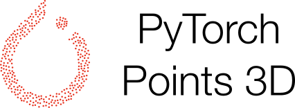

This is a framework for running common deep learning models for point cloud analysis tasks against classic benchmark datasets. It heavily relies on [```Pytorch Geometric```](https://github.com/rusty1s/pytorch_geometric) and [```Facebook Hydra library```](https://hydra.cc/docs/intro) thanks for the great work!

Here is the link toward the [```Github```](https://github.com/nicolas-chaulet/deeppointcloud-benchmarks) project.

We aim at building a tool for both benchmarking SOTA models and to efficiently pursue research for point cloud analysis with hope to bring them into real-life applications.


<h2>Core features</h2>

* ```Task driven``` implementation with dynamic model and dataset resolution from arguments
* ```Core``` implementation for simplying new model creation 
    * [```Core Architectures``` as Unet]
    * [```Core Modules``` as ResBlock]
    * [```Core Transforms``` as GridSampling, Rotation, Scale]
    * [```Core Sampling``` as FPS]
    * [```Core Neighbour Finder``` as Radius Search]
* ```4 Base Convolution``` to simplify new convolution implementation
    * [```DENSE``` (B, num_points, C)]
    * [```PARTIAL DENSE``` (B * num_points, C)]
    * [```MESSAGE PASSING``` (B * num_points, C)]
    * [```SPARSE``` (B * num_points, C)]

* ```2 API``` to write models ```(compact / sequential)``` to ease reproducibility
* Several visualiation tool ```(tensorboard, wandb)``` and ```dynamic metric-based model checkpointing``` for one to customize
* ```Dynamic customized placeholder resolution``` for smart model definition

<h2>Current supported models</h2>

* [```RandLA-Net```: Efficient Semantic Segmentation of Large-Scale Point Clouds ](https://arxiv.org/pdf/1911.11236.pdf)
* [```Relation-Shape Convolutional (RSConv)``` Neural Network for Point Cloud Analysis](https://arxiv.org/abs/1904.07601)
* [```KPConv```: Flexible and Deformable Convolution for Point Clouds](https://arxiv.org/abs/1904.08889)
* [```PointCNN```: Convolution On X-Transformed Points](https://arxiv.org/abs/1801.07791)
* [```PointNet++```: Deep Hierarchical Feature Learning on Point Sets in a Metric Space](https://arxiv.org/abs/1706.02413)
* [```Submanifold sparse convolutional networks```](https://arxiv.org/pdf/1711.10275.pdf)

and much more to come ...


<h2>Current supported tasks</h2>

* Segmentation
* Classification

## Ressources

* [Pytorch Geometric Slides](http://rusty1s.github.io/pyg_slides.pdf)


