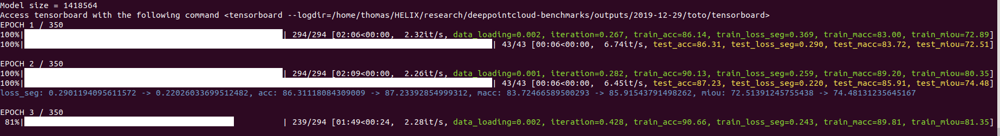
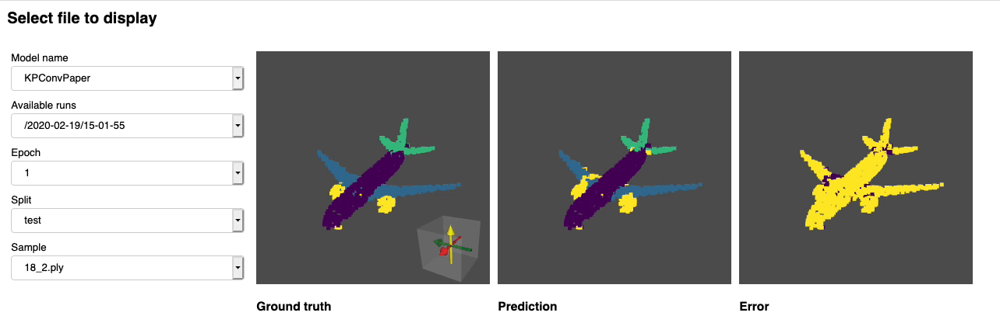

:github_url: https://github.com/nicolas-chaulet/torch-points3d

Getting Started
================

You're reading this because the API wasn't cracking it and you would like to extend the framework for your own task or use 
some of the deeper layers of our codebase. This set of pages will take you from setting up the code for local development 
all the way to adding a new task or a new dataset to the framework.
For using Torch Points3D as a library please refer to :ref:`this section<index:Install with pip>`.

Installation
----------------------------

Install Python 3.6 or higher
^^^^^^^^^^^^^^^^^^^^^^^^^^^^^^^^

Start by installing Python  > 3.6. You can use pyenv by doing the following:

.. code-block:: bash

   curl -L https://github.com/pyenv/pyenv-installer/raw/master/bin/pyenv-installer | bash

Add these three lines to your ``.bashrc``

.. code-block:: bash

   export PATH="$HOME/.pyenv/bin:$PATH"
   eval "$(pyenv init -)"
   eval "$(pyenv virtualenv-init -)"

Finaly you can install ``python 3.6.10`` by running the following command

.. code-block:: bash

   pyenv install 3.6.10

Install dependencies using poetry
^^^^^^^^^^^^^^^^^^^^^^^^^^^^^^^^^^

Start by installing poetry:

.. code-block:: bash

   pip install poetry

You can clone the repository and install all the required dependencies as follow:

.. code-block:: bash

   git clone https://github.com/nicolas-chaulet/torch-points3d.git
   cd torch-points3d
   pyenv local 3.6.10
   poetry install --no-root

You can check that the install has been successful by running

.. code-block:: bash

   poetry shell
   python -m unittest -v

Minkowski engine support
^^^^^^^^^^^^^^^^^^^^^^^^^

The repository is supporting `Minkowski Engine <https://stanfordvl.github.io/MinkowskiEngine/>`_ which requires `openblas-dev` and `nvcc` if you have a CUDA device on your machine. First install `openblas`

.. code-block:: bash

   sudo apt install libopenblas-dev

then make sure that `nvcc` is in your path:

.. code-block:: bash

   nvcc -V

If it's not then locate it (`locate nvcc`) and add its location to your `PATH` variable. On my machine:

.. code-block:: bash

   export PATH="/usr/local/cuda-10.2/bin:$PATH"

You are now in a position to install MinkowskiEngine with GPU support:

.. code-block:: bash

   poetry install -E MinkowskiEngine --no-root

Installation within a virtual environment
^^^^^^^^^^^^^^^^^^^^^^^^^^^^^^^^^^^^^^^^^^^

We try to maintain a ``requirements.txt`` file for those who want to use plain old ``pip``. Start by cloning the repo:

.. code-block:: bash

   git clone https://github.com/nicolas-chaulet/torch-points3d.git
   cd torch-points3d

We still recommend that you first create a virtual environment and activate it before installing the dependencies:

.. code-block:: bash

   python3 -m virtualenv pcb
   source pcb/bin/activate

Install all dependencies:

.. code-block:: bash

   pip install -r requirements.txt

You should now be able to run the tests successfully:

.. code-block:: bash

   python -m unittest -v

Train!
-----------------------

You should now be in a position to train your first model. Here is how is goes to train pointnet++ on part segmentation task for dataset shapenet, simply run the following:

.. code-block:: bash

   python train.py  \
       task=segmentation model_type=pointnet2 model_name=pointnet2_charlesssg dataset=shapenet-fixed

And you should see something like that

The `config <https://github.com/nicolas-chaulet/torch-points3d/blob/master/conf/models/segmentation/pointnet2.yaml>`_ for pointnet++ is a good example starting point to understand how models are defined:

.. literalinclude:: ../../conf/models/segmentation/pointnet2.yaml
   :language: yaml
   :lines: 87-122

Once the training is complete, you can access the model checkpoint as well as any visualisation and graphs that you may have generated in the ``outputs/<date>/<time>`` folder where date and time correspond to the time where you launched the training. 

Visualise your results
------------------------

We provide a `notebook <notebooks/dashboard.ipynb>`_ based on `pyvista <https://docs.pyvista.org/>`_ and `panel <https://panel.holoviz.org/>`_ that allows you to explore your past experiments visually. When using jupyter lab you will have to install an extension:

.. code-block:: bash
    
    jupyter labextension install @pyviz/jupyterlab_pyviz

Once this is done you can launch jupyter lab from the root directory and run through the notebook. You should see a dashboard starting that looks like the following:

Project structure
-------------------

The ambition of the project is to be a base for all point cloud related deep learning research. As such we wanted to make it
scalable and also ensure that components could be reused. Below is the overall structure of the project:

.. code-block:: bash

   ├── benchmark                 # Output from various benchmark runs
   ├── conf                      # All configurations for training nad evaluation leave there
   ├── notebooks                 # A collection of notebooks that allow result exploration and network debugging
   ├── docker                    # Docker image that can be used for inference or training
   ├── docs                      # All the doc
   ├── eval.py                   # Eval script
   ├── find_neighbour_dist.py    # Script that helps find the optimal number of neighbours for neighbour search operations
   ├── forward_scripts           # Script that runs a forward pass on possibly non annotated data
   ├── outputs                   # All outputs from your runs sorted by date
   ├── scripts                   # Some scripts to help manage the project
   ├── torch_points3d                       
   │   ├── core                  # Core components
   │   ├── datasets              # All code related to datasets
   │   ├── metrics               # All metrics and trackers
   │   ├── models                # All models
   │   ├── modules               # Basic modules that can be used in a modular way
   │   ├── utils                 # Various utils
   │   └── visualization         # Visualization
   ├── test
   └── train.py                  # Main script to launch a training

.. note::
   As a general philosophy we have split datasets and models by task. For example, datasets has three subfolders:
   
   - segmentation 
   - classification
   - registration

   where each folder contains the dataset related to each task.