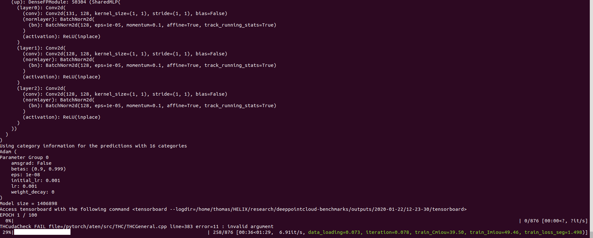

:github_url: "https://github.com/nicolas-chaulet/deeppointcloud-benchmarks"

Getting Started
================

Installation
----------------------------

Install Python 3.6 or higher
^^^^^^^^^^^^^^^^^^^^^^^^^^^^^^^^

Start by installing Python  > 3.6. You can use pyenv by doing the following:

.. code-block:: bash

   curl -L https://github.com/pyenv/pyenv-installer/raw/master/bin/pyenv-installer | bash

Add these three lines to your ``.bashrc``

.. code-block:: bash

   export PATH="$HOME/.pyenv/bin:$PATH"
   eval "$(pyenv init -)"
   eval "$(pyenv virtualenv-init -)"

Finaly you can install ``python 3.6.10`` by running the following command

.. code-block:: bash

   pyenv install 3.6.10

Install dependencies using poetry
^^^^^^^^^^^^^^^^^^^^^^^^^^^^^^^^^^

Start by installing poetry:

.. code-block:: bash

   pip install poetry

You can clone the repository and install all the required dependencies as follow:

.. code-block:: bash

   git clone https://github.com/nicolas-chaulet/deeppointcloud-benchmarks.git
   cd deeppointcloud-benchmarks
   pyenv local 3.6.10
   poetry install

You can check that the install has been successful by running

.. code-block:: bash

   poetry shell
   python -m unittest

Installation within a virtual environment
^^^^^^^^^^^^^^^^^^^^^^^^^^^^^^^^^^^^^^^^^^^

We try to maintain a ``requirements.txt`` file for those who want to use plain old ``pip``. Start by cloning the repo:

.. code-block:: bash

   git clone https://github.com/nicolas-chaulet/deeppointcloud-benchmarks.git
   cd deeppointcloud-benchmarks

We still recommend that you first create a virtual environment and activate it before installing the dependencies:

.. code-block:: bash

   python3 -m virtualenv pcb
   source pcb/bin/activate

Install all dependencies:

.. code-block:: bash

   pip install -r requirements.txt

You should now be able to run the tests successfully:

.. code-block:: bash

   python -m unittest

Train!
-----------------------

You should now be in a position to train your first model. Here is how is goes to train pointnet++ on part segmentation task for dataset shapenet, simply run the following:

.. code-block:: bash

   python train.py  \
       task=segmentation model_type=pointnet2 model_name=pointnet2_charlesssg dataset=shapenet

And you should see something like that

The `config <https://github.com/nicolas-chaulet/deeppointcloud-benchmarks/blob/master/conf/models/segmentation/pointnet2.yaml>`_ for pointnet++ is a good example starting point to understand how models are defined:

.. literalinclude:: ../../conf/models/segmentation/pointnet2.yaml
   :language: yaml
   :lines: 87-122

Once the training is complete, you can access the model checkpoint as well as any visualisation and graphs that you may have generated in the ``outputs/<date>/<time>`` folder where date and time correspond to the time where you launched the training. 

Visualise your results
------------------------

We provide a `notebook <dashboard/dashboard.ipynb>`_ based on `pyvista <https://docs.pyvista.org/>`_ and `panel <https://panel.holoviz.org/>`_ that allows you to explore your past experiments visually. When using jupyter lab you will have to install an extension:

.. code-block:: bash
    
    jupyter labextension install @pyviz/jupyterlab_pyviz

Once this is done you can launch jupyter lab from the root directory and run through the notebook. You should see a dashboard starting that looks like the following:

.. image::
    ../imgs/Dashboard_demo.gif

Project structure
-------------------

TBD