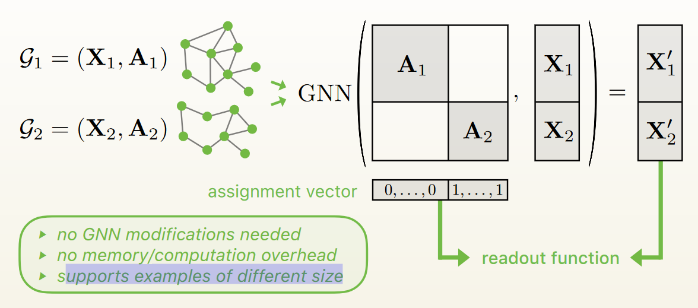

While developing this project, we discovered there are several ways to implement a convolution.

We denoted 4 different formats and they all have their own advantages and drawbacks using two different collate function.
The collate function denotes how a list of examples is converted to a batch

* [```torch.utils.data.DataLoader```](https://pytorch.org/docs/stable/_modules/torch/utils/data/dataloader.html)
    - ```"DENSE"```

* [```torch_geometric.data.DataLoader```](https://pytorch-geometric.readthedocs.io/en/latest/_modules/torch_geometric/data/dataset.html#Dataset)
    - ```"PARTIAL_DENSE"```
    - ```"MESSAGE_PASSING"```
    - ```"SPARSE"```

<h4> DENSE ConvType Format with torch.utils.data.DataLoader</h4>

The N tensor of shape (num_points, feat_dim) will be concatenated on a new dimension
[(num_points, feat_dim), ..., (num_points, feat_dim)] -> (N, num_points, feat_dim)

This format forces each tensor to have exactly the same shape

Advantages

* The format is dense and therefore aggregation operation are fast

Drawbacks

* When ```neighbour finder``` is applied. Each point is going to be forced to have         ```max_num_neighbors: default = 64```. Therefore, they will lot of shadow points to complete the batch_size, creating extra useless memory consumption

<h2> torch_geometric.data.DataLoader TYPE </h2>



The collate function can be found there [```Batch.from_data_list```](https://pytorch-geometric.readthedocs.io/en/latest/_modules/torch_geometric/data/batch.html#Batch)

Given ```N tensors``` with their own ```num_points_{i}```, the ```collate function``` does:
```[(num_points_1, feat_dim), ..., (num_points_n, feat_dim)] -> (num_points_1 + ... + num_points_n, feat_dim)```

It also creates an associated ```batch tensor``` of size ```(num_points_1 + ... + num_points_n)``` with indices of the corresponding batch.

```Example```:

* A with shape (2, 2)
* B with shape (3, 2)

```C = Batch.from_data_list([A, B])```

C is a tensor of shape ```(5, 2)``` and its associated batch will contain ```[0, 0, 1, 1, 1]```


<h4> PARTIAL_DENSE ConvType Format </h4>

This format is used by KPConv original implementation.


Same as dense format, it forces each point to have the same number of neighbors.
It is why we called it partially dense.

<h4> MESSAGE_PASSING ConvType Format </h4>

This ConvType is Pytorch Geometric base format.
Using [```Message Passing```](https://pytorch-geometric.readthedocs.io/en/latest/_modules/torch_geometric/nn/conv/message_passing.html#MessagePassing) API class, it deploys the graph created by ```neighbour finder``` using internally the ```torch.index_select``` operator.

Therefore, the ```[PointNet++]``` internal convolution looks like that.

```python
import torch
from torch_geometric.nn.conv import MessagePassing
from torch_geometric.utils import remove_self_loops, add_self_loops

from ..inits import reset

class PointConv(MessagePassing):
    r"""The PointNet set layer from the `"PointNet: Deep Learning on Point Sets
    for 3D Classification and Segmentation"
    <https://arxiv.org/abs/1612.00593>`_ and `"PointNet++: Deep Hierarchical
    Feature Learning on Point Sets in a Metric Space"
    <https://arxiv.org/abs/1706.02413>`_ papers
    """

    def __init__(self, local_nn=None, global_nn=None, **kwargs):
        super(PointConv, self).__init__(aggr='max', **kwargs)

        self.local_nn = local_nn
        self.global_nn = global_nn

        self.reset_parameters()

    def reset_parameters(self):
        reset(self.local_nn)
        reset(self.global_nn)


    def forward(self, x, pos, edge_index):
        r"""
        Args:
            x (Tensor): The node feature matrix. Allowed to be :obj:`None`.
            pos (Tensor or tuple): The node position matrix. Either given as
                tensor for use in general message passing or as tuple for use
                in message passing in bipartite graphs.
            edge_index (LongTensor): The edge indices.
        """
        if torch.is_tensor(pos):  # Add self-loops for symmetric adjacencies.
            edge_index, _ = remove_self_loops(edge_index)
            edge_index, _ = add_self_loops(edge_index, num_nodes=pos.size(0))

        return self.propagate(edge_index, x=x, pos=pos)


    def message(self, x_j, pos_i, pos_j):
        msg = pos_j - pos_i
        if x_j is not None:
            msg = torch.cat([x_j, msg], dim=1)
        if self.local_nn is not None:
            msg = self.local_nn(msg)
        return msg

    def update(self, aggr_out):
        if self.global_nn is not None:
            aggr_out = self.global_nn(aggr_out)
        return aggr_out

    def __repr__(self):
        return '{}(local_nn={}, global_nn={})'.format(
            self.__class__.__name__, self.local_nn, self.global_nn)
```

<h4> SPARSE ConvType Format </h4>


| Dense Tensor                                                                    | Sparse Tensor                                                                     |
|:-------------------------------------------------------------------------------:|:---------------------------------------------------------------------------------:|
|  |  |

The sparse conv type is used by project like [```SparseConv```](https://github.com/facebookresearch/SparseConvNet) or [```Minkowski Engine```](https://github.com/StanfordVL/MinkowskiEngine)

Therefore, the points have to be converted into indices living within a grid.