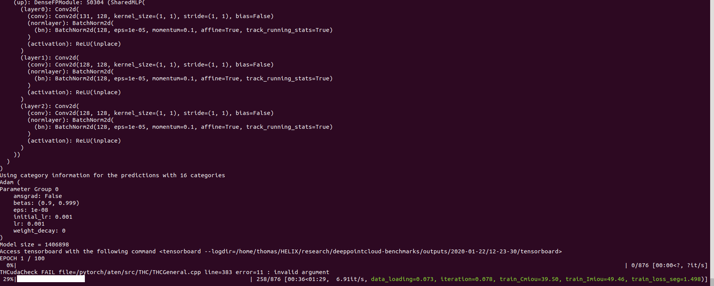

## Train your first model

You should now be in a position to train your first model. Here is how is goes to train pointnet++ on part segmentation task for dataset shapenet, simply run the following:

```bash
python train.py  \
    task=segmentation model_type=pointnet2 model_name=pointnet2_charlesssg dataset=shapenet
```
And you should see something like that



The [config](https://github.com/nicolas-chaulet/deeppointcloud-benchmarks/blob/master/conf/models/segmentation/pointnet2.yaml) for pointnet++ is a good example starting point to understand how models are defined:

```yaml
# PointNet++: Deep Hierarchical Feature Learning on Point Sets in a Metric Space (https://arxiv.org/abs/1706.02413)
# Credit Charles R. Qi: https://github.com/charlesq34/pointnet2/blob/master/models/pointnet2_part_seg_msg_one_hot.py

pointnet2_onehot:
    architecture: pointnet2.PointNet2_D
    conv_type: "DENSE"
    use_category: True
    down_conv:
        module_name: PointNetMSGDown
        npoint: [1024, 256, 64, 16]
        radii: [[0.05, 0.1], [0.1, 0.2], [0.2, 0.4], [0.4, 0.8]]
        nsamples: [[16, 32], [16, 32], [16, 32], [16, 32]]
        down_conv_nn:
            [
                [[FEAT, 16, 16, 32], [FEAT, 32, 32, 64]],
                [[32 + 64, 64, 64, 128], [32 + 64, 64, 96, 128]],
                [[128 + 128, 128, 196, 256], [128 + 128, 128, 196, 256]],
                [[256 + 256, 256, 256, 512], [256 + 256, 256, 384, 512]],
            ]
    up_conv:
        module_name: DenseFPModule
        up_conv_nn:
            [
                [512 + 512 + 256 + 256, 512, 512],
                [512 + 128 + 128, 512, 512],
                [512 + 64 + 32, 256, 256],
                [256 + FEAT, 128, 128],
            ]
        skip: True
    mlp_cls:
        nn: [128, 128]
        dropout: 0.5
```

Once the training is complete, you can access the model checkpoint as well as any visualisation and graphs that you may have generated in the `outputs/<date>/<time>` folder where date and time correspond to the time where you launched the training. 